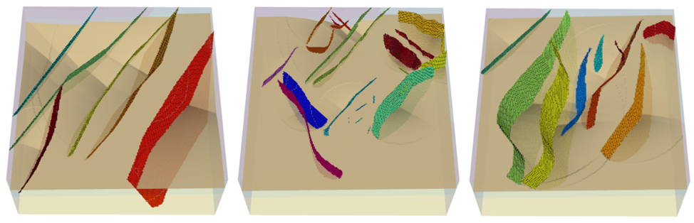
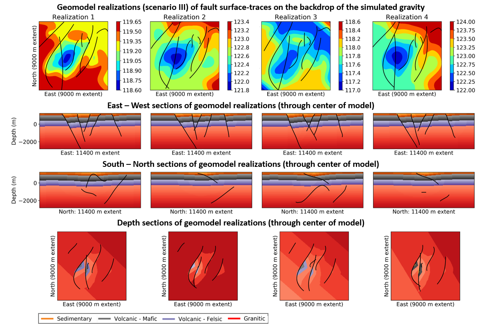

# Stochastic Structural Modeling of a Geothermal Field: Patua Geothermal Field Case Study

This is an accompanying repository to a Stanford Geothermal Workshop paper.

https://pangea.stanford.edu/ERE/db/GeoConf/papers/SGW/2020/Pollack.pdf

